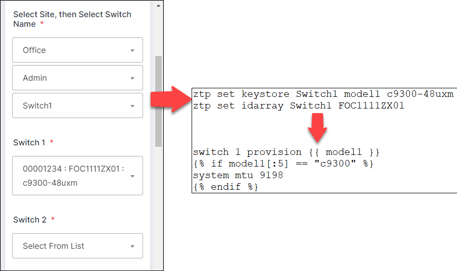

# JotForm Form Import Tool for freeZTP (JFIT-ZTP)

## What's New
- Converted to Python package style
- Removed compatibility for Python 3.5 and earlier
- Menu Driven Setup
- Standalone template file for external notifications
- [Mostly] PEP compliant

## Introduction
JFIT-ZTP is a purpose built data extraction tool.  It maps answer data from JotForm to functional configuration for freeZTP.

**What is JotForm?** JotForm is a flexible form generation platform.  They offer both free and paid subscription services.  Subscription level will determine  monthly submission, storage, and API call limits among other features.  Please visit [jotform.com](https://www.jotform.com) for more details.

**What is freeZTP?** freeZTP (or just ZTP) is an open-source project which automates deployment of Cisco switches and routers. Cisco has included a unique first-boot behavior in IOS / IOS-XE for Zero Touch Provisioning.  See [packetsar/freeztp](https://github.com/PackeTsar/freeztp) on GitHub for more details.

**Additional Reading** If the README didn't put you to sleep, then try the ["Practical Guide"](documentation/practical_stack_guide.md) posted in documentation.

## Background
freeZTP has been instrumental for time savings in large scale deployments of Cisco switches (500 to 1500 units).  Several issues related to planning and logistics have been seen in these projects.

**Staging -** From the perspective of a VAR or consulting company, staging is a time consuming task which adds cost to the project. Staging assumes that the IDF design and site details are known.  Once a device has been staged for a specific site that device can only be used there (short of wiping the config).

**Logisitics -** From the perspective of the warehouse team, finding a single serial number to deploy to a remote site could be extremely time consuming.  Allowing the warehouse to simply match model when preparing a site shipment is extremely efficient.

**Proposed Solution -**  Simply send the correct number of each device model to a site.  Have the field team install equipment according to documented plans and use ZTP to deploy the appropriate configuration.  This is where JFIT-ZTP comes in.  The field team will create the serial-to-hostname mapping by entering the data in JotForm from their smartphones.  JFIT-ZTP will pick up the new entries from JotForm and apply the configuration to ZTP automatically. (NOTE: DOA failure rates are typically 0.1%, so the field team should be supplied with spares to ensure completion on the first visit.)

## Mechanism
JFIT-ZTP allows for CLI style or external keystore (CSV) style configuration of ZTP. In CLI style, Jotform data is mapped to CLI commands (see image below).  In CSV style, Jotform data is mapped to fields in the external keystore.  After updates are made to ZTP, the ZTP service is automatically restarted by JFIT-ZTP. Per the freeZTP documentation, idarray and keystore data is passed to the Jinja2 template engine for use in configuration templates.

After updates to ZTP are executed the JotForm submissions are marked "read".  This limits the returned data for each execution of JFIT-ZTP and speeds up processing.

**NOTE:** In CSV style, IDArray and KeyStore data is mapped into the external keystore. Association (template) mapping can use the ZTP default, a static field in the CSV, or dynamic data from JotForm.

## Compatibility
These have been tested so far.  Install instructions based on tested platforms.
- Platforms:
  - Debian Buster (10) and derivative distros including Ubuntu 20.04LTS and Raspbian Kernel 5 (PiOS)
  - Microsoft Windows 10 (development platform)
- Python: 3.6 and later only
  - **This deviates from current freeZTP installation. Be sure to use 'python3' as your command executable.**

## Installation
This procedure assumes that you have already installed freeZTP and it is running as expected.
1. Log in with same account that ZTP is running under
2. Elevate your permissions
   1. `sudo su`
3. Directly copy files to ZTP server or clone GitHub repo (shown)
   1. `git clone https://github.com/pschapman/jfit-ztp`
4. Change working directory to jfit-ztp
   1. `cd jfit-ztp`
5. Install required external modules (if not already installed)
   1. `pip3 install -r requirements.txt`
6. Run JFIT-ZTP setup
   1. `python3 jfit_ztp.py -s` or `python jfit_ztp.py --setup`
7. Use Menu-based setup
   1. Minimum Required Configuration
      1. JotForm API Key and Form ID
      2. freeZTP Keystore Type (CLI or CSV). Defaults to CLI
      3. Jotform Answer Mappings
         1. Download sample submission
         2. Set Keystore ID and ID Array mappings
   2. Optional Configurations
      1. Change maximum stack size. Defaults to 1
      2. Set custom variable mappings
      3. Set custom delimiter for compound answers. Defaults to ":"
      4. set custom null answer. Defaults to "Select From List"
      5. Configure Cisco WebEx Teams notifications via Bot
      6. Configure Webhook based notifications
8.  Configure JFIT-ZTP to run as a cron job
    1.  `crontab -e`
    2.  Add: `* * * * * cd /<path>/jfit-ztp && python3 jfit_ztp.py`
    3.  Save update and exit
    4.  Restart cron service: `systemctl restart cron`
    5.  **NOTE:** Once per minute is recommended for active implementation.
    6.  **WARNING:** JotForm limits API calls per day, so verify you will not exceed your limit before configuring your cron job.

## Open Issues for v2.0.1
- Some functions need additional refactoring in worker and shared modules. (Variable names and other minor inconsistencies.)
- Refactor some functions in setup to be more DRY compliant.
- Module DocStrings need update
- WebEx Integrations and Webhooks require additional testing

## Future features
- Automate manual installation steps
  - Installation of external modules
  - Configuration of cron job
- Test automation on Git
- Module buildout for publication on PyPi
- Notifications integration to Slack using webhook.

## Change Log
- **2.0.1 - 2022/03/30**
  - Main executable renamed "jfit_ztp.py" to match PEP style guides.
  - Completely refactored from monolithic script to Python Package style.
    - Fully linted with Pylint and Pylance
  - Setup completely rewritten. New method is completely menu driven instead of Wizard.
    - Answer mappings can be entirely wiped from setup instead of deleting json config file.
  - Changes to Answer mapping schema.  Update requires config rebuild.
  - Standalone template file (`template_text.py`) for external notifications.  Contains comments and samples.  Baseline configuration should work for most deployments.
- **0.9.4 Beta - 2021/05/29**
  - Added simple notifications integration for MS Teams via Power Automate. JFIT-ZTP will send a JSON formatted message to a Power Automate flow using the "When a HTTP request is received" trigger.  Power Automate can then process the message and deliver to the appropriate MS Teams room.
- **0.9.3 Beta - 2021/04/11**
  - Altered update logic to automatically clear fields that have the Null Answer in the JotForm submission.  For CLI style, JFIT-ZTP now issues `ztp clear` commands as needed.  For CSV style, JFIT-ZTP will clear any data from the appropriate field.
  - Added simple WebEx Teams notification feature.  Add your Bot Token and room during setup. Mardown file with sample added to Git Repo under documentation.
  - Fixed bug in dict_to_q_menu that occurs when JotForm returns non-contiguous numeric values in answer set.  Occurs when questions are removed from JotForm.
- **0.9.2 Beta - 2021/04/10**
  - Realized error in trying to manually parse CLI arguments.  Switched to ArgParse native module.  Setup now uses -s / --setup arguments.
  - File and console logging added.  File logging is 'Info' by default (changable in code).  Console logging is disabled by default and can be enabled with -v and -d options, meaning verbose (Info) and debug respectively.
  - Fixed logic error regarding delimiters in get_answer_element.
  - Updated install instructions in readme.
- **0.9 Beta - Initial release - 2021/04/03**
