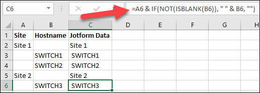
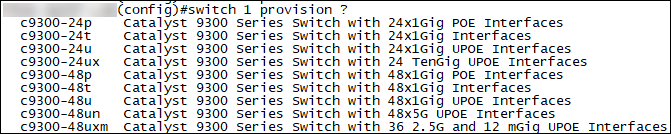
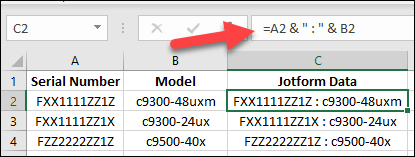
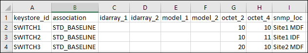
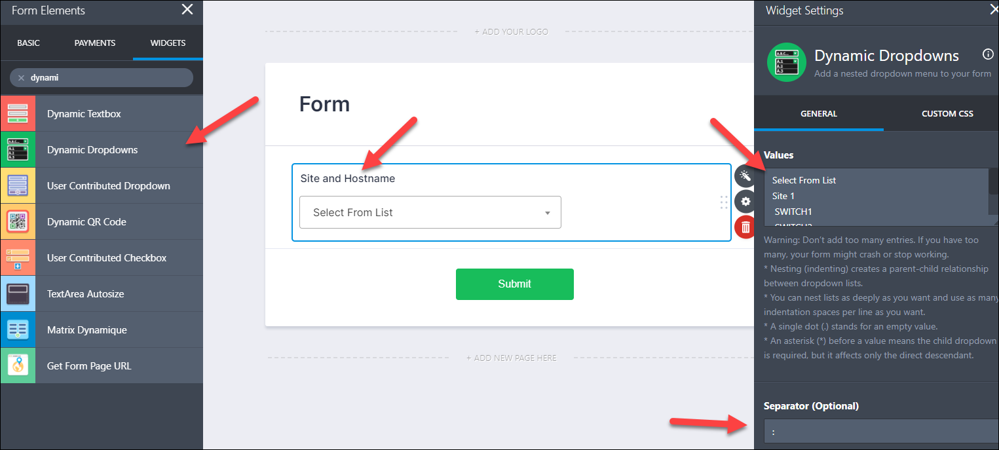

# Practical Guide for Deploying Cisco Switch Stacks with JotForm and freeZTP
## Introduction
This guide is designed to provide some basic ideas and practical advice on how to use JotForm for large scale deployments of Cisco switch stacks.  The guide will cover configuration of JotForm for 2 switch stacks at multiple sites.  On the ZTP side it will show the use of the external keystore and how to use custom variables in your config templates.

**JotForm Warning:** If you are not familiar with JotForm, it is recommended that you experiment with it for 3-5 hours before attempting to implement a Form for use with freeZTP.

**freeZTP Warning:** This guide presents advanced configurations in freeZTP.  You must be familiar with "keystores", "idarrays", and "template associations" and how they are implemented.  Previous freeZTP experience is highly recommended.  This guide does not cover DHCP, initial templates, or basic connectivity requirements.

## Project Goals
For the purposes of this guide, we have the following goals:
- Minimize oversight of field teams while ensuring accurate deployment.
- Reduce time waste in staging by configuring switches on-the-fly at deployment time.
- Provide simple mechanism for field team to associate hostnames and serial numbers.
  - Minimize data entry errors by not allowing free-form data entry.
  - All JotForm fields must be a "select option" (e.g. drop-down, radio button, spinner, etc.)
  - Project includes 100 sites with 2 to 10 switches per site
- Provide simple mechanism to pass complex configuration parameters to freeZTP for use in templates
  - Use model information to pre-configure switch ports without requiring that all stack members be online prior to ZTP.

## Get Organized
> If you fail to plan, you are planning to fail. --Benjamin Franklin

Planning the deployment will be the key to success. To build our JotForm with only "select option" form elements, we will need to gather the necessary data to pre-populate those elements.  We will need the following:
- Site names and associated switch names
  - We will create a multi-level drop-down to make it easier for field tech to find the appropriate hostname
- Serial numbers and associated model
  - For stackable switches, the model must be a value that is usable by the `switch <#> provision <model>` command
- Host name to static data
  - For this project, template association, snmp location, and the 2nd and 4th octets of the management IP will be static data pre-configured in the external keystore.

### Site Names and Associated Hostname
Obtaining this data requires knowledge of the target environment either directly or through discovery.

For repeatability this data can be organized in Microsoft Excel (or Google Sheets). The image below provides a simple view showing how to space-indent data for use with JotForm's Dynamic Dropdown Widget.


### Serial Numbers and Associated Models
This data can be obtained several ways.  The easiest method is to pull it out of Cisco's Sales Order (SO) report.  If that is not available, then serials must be scanned in during the receiving process.

To pre-provision interfaces on mixed stacks we must use known values for the switch model we are using.  The image below shows how we obtained a list from a Cisco Catalyst 9300-series switch.


Again, we will use Excel to prepare our JotForm data.  Again, we will use the Dynamic Dropdown Widget because it is searchable. (Field techs can put in a partial serial to find the exact item from the list.)


**NOTE:** Asset tag is a possible addition to this data, and may be easier for field techs to type.

### Plan Variable Use in Templates
Templates are where the rubber meets the road for freeZTP.  Once the device requesting a configuration has been identified, freeZTP auto-generates the final configuration using a template.  Because it is using Jinja2 for templating, we can create a flexible and dynamic template that can be used on many different platforms.

Here are some samples. For more, see "Tips" on the freeZTP Github site.

#### Management Address
```
interface Vlan10
 ip address 10.{{ octet_2 }}.1.{{ octet_4 }}
 no shut
```

#### SNMP Location
```
snmp-server location {{ snmp_loc }}
```

#### Port Pre-provisioning
**NOTE:** This sample shows conditional and looping logic for Jinja2.
```



!


switch {{ loop.index }} provision {{ model }}


!
!
!
interface range Te{{ loop.index }}/0/1-24
 switchport access vlan 10
 switchport mode access
!

!
interface range Tw{{ loop.index }}/0/1-36
 switchport access vlan 10
 switchport mode access
!
interface range Te{{ loop.index }}/0/37-48
 switchport access vlan 10
 switchport mode access
!

!
interface range Te{{ loop.index }}/0/1-24
 switchport mode trunk
!

!
```

### Static Keystore Data
The first column in the External Keystore should always be "keystore_id".  This field is the minimum data required by freeZTP.

To maximize the capabilities of freeZTP, we will pre-populate data that is important to the deployment, but is not coming from JotForm.  Specifically, we will pre-populate the template association, SNMP location, and the 2nd and 4th octets of the device management IP.


**NOTE:** "keystore_id", "association", and "idarray_#" are freeZTP native variables. All other columns are headed by custom variables for this deployment.

## Build Form in JotForm
This task list outlines building a basic Form for a stack of 2 switches.  Advanced features are not covered.  Increased stack size or additional custom variables should be apparent.  **NOTE:** CSS adjustments to provide better viewing experience on mobile devices is not covered.  See JotForm support forum for assistance.
1. Log on to JotForm website
2. Create a new form
   1. Choose start from Scratch / Classic Form
3. Create "Site and Hostname" question **(image below)**
   1. Add a "Dynamic Dropdown" widget
   2. Change the name to "Site and Hostname"
   3. Paste in the site and hostname list from MS Excel (see screenshot above)
      1. Add "Select From List" (case sensitive)**\*** as the first item at the top
   4. Change the "Separator" to a colon (:)**\*\***
4. Create "Switch 1" question
   1. Add a "Dynamic Dropdown" widget
   2. Change the name to "Switch 1"
   3. Paste in the serial and model data from MS Excel (see screenshot above)
      1. Add "Select From List" (case sensitive)**\*** as the first item at the top
5. Duplicate "Switch 1" and rename it to "Switch 2"
6. Configure other features as necessary
   1. Email
   2. Thank You page
   3. Custom URL
7. Test Form on phones and tablets to ensure proper user experience



\* **NOTE 1:** "Select From List" is the Null Answer that will be ignored by JFIT-ZTP.  This string is case sensitive.  ***A mismatch will cause defective data to be imported into freeZTP.***

\*\* **NOTE 2:** "Separator" in Jotform is called "delimter" in JFIT-ZTP and is used to extract individual fields from compound answers.  Ex. Site and Hostname might return "Site 1 : SWITCH2". JFIT-ZTP can extract either element as long as the separator is consistent in all answers.

## Configure freeZTP
This task list outlines post install tasks for freeZTP, but may not include in-depth detail for each.
1. Upload custom configuration template to freeZTP host, then apply to configuration.
   1. `ztp set external-template STD_BASELINE file '<full path>'`
2. Upload external keystore file with pre-configured fields to freeZTP host, then apply to configuration.
   1. `ztp set external-keystore EXTKEY1 type csv`
   2. `ztp set external-keystore EXTKEY1 file '<full path>'`
3. Inject sample data into freeZTP and perform merge-test to validate template

## Configure JFIT-ZTP
The following text shows a sample setup using the data as shown above.  CSV is the default method and will be selected for use with ZTP (as discussed in the plan above).  As planned, stack quantity will be set to 2.

```
ztpadmin@ztp:~$ sudo su
[sudo] password for ztpadmin: 

root@ztp:/home/ztpadmin# cd jfit-ztp

root@ztp:/home/ztpadmin/jfit-ztp# python jfit-ztp.py -s

================================API KEY=================================
 Please provide your JotForm API key.  Key must have "Full Access"
 permissions. Script will look only for new submissions, then mark
 mark those submissions "read" when processing is done.
========================================================================
What is your API key? > <REDACTED>


==============================SELECT FORM===============================
 Please select your Form from the list below.  Only "Enabled" forms
 are listed.
========================================================================
Which Form is being used for this deployment? > 
1. <REDACTED>
2. <REDACTED>
3. <REDACTED>
4. <REDACTED>
5. Form
5


===============================DELIMITER================================
 Script will recognize and parse compound answers.  For simplicity
 only 1 (one) single character delimiter is allowed.

 Example compound answer "ab12345 : FOC1111ZXY2 : c9300-48p", where:
 - Colon (:) is the delimiter
 - ab12345 is an asset tag (Custom Variable)
 - FOC1111ZXY2 is a serial number
 - c9300-48p is a valid "provision" command value (Custom Variable)
 NOTE: Leading and terminal spaces will be stripped.
========================================================================
What is the delimiter? (enter for default [:]) > :


============================OPERATIONAL MODE============================
 Select mode of operation.

 - CSV Mode: All keystore and idarray information is stored in an
 external keystore file.  Association data (template), if not using
 the default, MUST also be stored in the external keystore.
 - CLI Mode: All keystore and idarray information will be stored in
 freeZTP's embedded config file.
========================================================================
Select script mode. (enter for default [csv]) 
1. CLI
2. CSV
2
Enter explicit path to keystore file. (ex. /etc/my.csv) > /home/ztpadmin/ztp/keystore.csv


=============================IMPORT UNKNOWN=============================
 CSV Mode Only - Specify whether unknown keystore_ids should be added
 to the external keystore.  Default is NO.
 Enabling this feature will automatically generate new rows in the
 external keystore. IMPACT: If you are pre-populating the external
 keystore with host specific information, like management IP addresses,
 then be aware these fields will be empty for newly generated rows.
 THIS MAY IMPACT JUST-IN-TIME DEPLOYMENT OPERATIONS.
========================================================================
Enable Unknown ID Import? (y/N) > n


==============================NULL ANSWER===============================
 Specify the Null Answer string which should be ignored. For simplicity,
 only one Null Answer is allowed.

EXPLANATION:
 Most JotForm form elements allow for a default answer in case the user
 skips the question.  For the purposes of ZTP, dropdown lists and the
 Dynamic Dropdown Widget often present the most efficient way to get
 both consistent and accurate answers from data entry personnel. Manual
 data entry should generally be avoided for obvious reasons.
 When device deployment is widely varied (e.g. switch stacks from 1 to 8
 members), it is expected that some questions should be unanswered.

 - CLI Mode: Commands will not be generated for items with the Null
   Answer.
 - CSV Mode: Field will be left blank for items with the Null Answer.
========================================================================
Specify Null Answer. (enter for default [Select From List]) > Select From List


========================WEBEX TEAMS INTEGRATION=========================
 JFIT-ZTP is capable of sending update notifications through Cisco WebEx
 Teams.  This is accomplished using a "Bot".  The Bot must be added to
 a Room / Space like a normal user.  Room notifications are formatted in
 Markdown. A sample, "new_submission.md", is included in the Git Repo.
 Actual message markdown is embedded in the program code body.
========================================================================
Enable notifications to WebEx Teams? (y/N) > n


===========================SAMPLE SUBMISSION============================
 Setup needs a sample JotForm submission to map answers to freeZTP
 configuration commands / external keystore entries.

 *** PLEASE CREATE AND SUBMIT A FORM NOW ***
 *** FILL OUT ALL ANSWERS - LEAVE NO DEFAULT ***

 The submission ID will show in the url on the "Thank You" page.
 Ex: https://submit.jotform.com/submit/<15 digit #>

 Hit <enter> when ready to view list of forms.
========================================================================
Hit <enter> after Form is submitted... > 
Select item or hit <enter>. > 
1. 4940590410128493504
1


==============================KEYSTORE ID===============================
 Select the answer to map to the Keystore ID
 The Keystore ID in freeZTP is the common index value between ID Array
 data, keystore values, and template associations. When using JotForm
 with freeZTP the Keystore ID is likely to correspond with the hostname.
========================================================================


Choose item that has value for keystore_id? > 
1. Question: Form / Answer: None / Control:0001
2. Question: Submit / Answer: None / Control:0002
3. Question: Site and Hostname / Answer: Site 1 : SWITCH1 / Control:0003
4. Question: Switch 1 / Answer: FXX1111ZZ1Z : c9300-48uxm / Control:0004
5. Question: Switch 2 / Answer: FXX1111ZZ1X : c9300-24ux / Control:0005
3

Compound answer detected (delimiter in string).
Select item that contains keystore_id. > 
1. Site 1
2. SWITCH1
2


=============================ASSOCIATION ID=============================
 (OPTIONAL) Will JotForm provide the Association ID Value?
 The Association ID in freeZTP is mapping of a configuration template to
 a specific Keystore ID. If no association is specified, freeZTP will
 use its default value. RECOMMENDATIONS:
 - CLI Mode: Use freeZTP default value for single template cases. Use
   JotForm answer mapping when using freeZTP to image multiple platforms
   (e.g. routers & switches) and/or multiple roles (e.g. core & edge).
 - CSV Mode: Create "association" column in the external keystore and
   enter the appropriate field value when pre-loading other data.
========================================================================
Will this JotForm provide a template association? (y/N) > 


============================SWITCH STACKING=============================
 (OPTIONAL) Will this ZTP instance build switch stacks?
 freeZTP was built as a general purpose imaging system. For switch
 stacks, multiple IDs (serial numbers) can be assigned to the Keystore
 ID (idarray). This allows for proper device ID regardless of boot
 order. If "no" is selected, setup will prompt for one (1) serial number
 mapping. If "yes" is selected, setup will ask for a maximum stack size,
 then prompt to map each position.

 NOTE: If building mixed-model stacks it is recommended that you include
 the model information with each serial using the delimiter. FUN FACTS:
 1. ID array data is shared with the Jinja2 engine as idarray_x in the
    order they show up. This can be used for automatic stack re-ordering
    with EEM scripts.  See sample on the freeZTP GitHub site.
 2. If building mixed-model stacks, adding model information as a Custom
    Variable can allow for pre-population of port configurations before
    member switches join the stack. (switch <#> provision <model>
    Simplest setup places serial and model in same answer and separated
    by the delimiter (e.g. <serial> : <model>)
========================================================================
Will this ZTP instance provision switch stacks? (Y/n) > y
What is the maximum stack size? (default is 8) > 2


Choose item that has value for idarray_1? > 
1. Question: Form / Answer: None / Control:0001
2. Question: Submit / Answer: None / Control:0002
3. Question: Site and Hostname / Answer: Site 1 : SWITCH1 / Control:0003
4. Question: Switch 1 / Answer: FXX1111ZZ1Z : c9300-48uxm / Control:0004
5. Question: Switch 2 / Answer: FXX1111ZZ1X : c9300-24ux / Control:0005
4

Compound answer detected (delimiter in string).
Select item that contains idarray_1. > 
1. FXX1111ZZ1Z
2. c9300-48uxm
1


Choose item that has value for idarray_2? > 
1. Question: Form / Answer: None / Control:0001
2. Question: Submit / Answer: None / Control:0002
3. Question: Site and Hostname / Answer: Site 1 : SWITCH1 / Control:0003
4. Question: Switch 1 / Answer: FXX1111ZZ1Z : c9300-48uxm / Control:0004
5. Question: Switch 2 / Answer: FXX1111ZZ1X : c9300-24ux / Control:0005
5

Compound answer detected (delimiter in string).
Select item that contains idarray_2. > 
1. FXX1111ZZ1X
2. c9300-24ux
1


============================CUSTOM VARIABLES============================
 (OPTIONAL) Define Custom Variables
 Custom variables are mapped from JotForm to freeZTP commands / external
 keystore fields in the exact same way as other mappings. The difference
 is that custom variable names are your choice.
 RESTRICTION: BLANK SPACES ARE NOT ALLOWED IN CUSTOM VARIABLE NAMES

 Examples:
 - model1, model2, modelx: Possible use for mixed-model stacks
 - snmp_loc: Insert device meta-data in snmp location
========================================================================
Map a Custom Variable? (y/N) > y
Specify variable name. > model_1


Which answer contains the value for model_1? > 
1. Question: Form / Answer: None / Control:0001
2. Question: Submit / Answer: None / Control:0002
3. Question: Site and Hostname / Answer: Site 1 : SWITCH1 / Control:0003
4. Question: Switch 1 / Answer: FXX1111ZZ1Z : c9300-48uxm / Control:0004
5. Question: Switch 2 / Answer: FXX1111ZZ1X : c9300-24ux / Control:0005
4

Compound answer detected (delimiter in string).
Select item that contains model_1. > 
1. FXX1111ZZ1Z
2. c9300-48uxm
2
Map another Custom Variable? (y/N) > y
Specify variable name. > model_2


Which answer contains the value for model_2? > 
1. Question: Form / Answer: None / Control:0001
2. Question: Submit / Answer: None / Control:0002
3. Question: Site and Hostname / Answer: Site 1 : SWITCH1 / Control:0003
4. Question: Switch 1 / Answer: FXX1111ZZ1Z : c9300-48uxm / Control:0004
5. Question: Switch 2 / Answer: FXX1111ZZ1X : c9300-24ux / Control:0005
5

Compound answer detected (delimiter in string).
Select item that contains model_2. > 
1. FXX1111ZZ1X
2. c9300-24ux
2
Map another Custom Variable? (y/N) > n

Config File Contents:
{
    "bot_token": null, 
    "delimiter": ":", 
    "null_answer": "Select From List", 
    "room_id": null, 
    "form_id": "<REDACTED>", 
    "import_unknown": false, 
    "exec_mode": "csv", 
    "api_key": "<REDACTED>", 
    "csv_path": "/home/ztpadmin/ztp/keystore.csv", 
    "data_map": {
        "idarray_2": {
            "qID": "5", 
            "index": 0
        }, 
        "model_1": {
            "qID": "4", 
            "index": 1
        }, 
        "keystore_id": {
            "qID": "3", 
            "index": 1
        }, 
        "idarray_1": {
            "qID": "4", 
            "index": 0
        }, 
        "model_2": {
            "qID": "5", 
            "index": 1
        }
    }
}
Configuration saved to disk.
Sample submission marked as read.
SETUP COMPLETE!
```